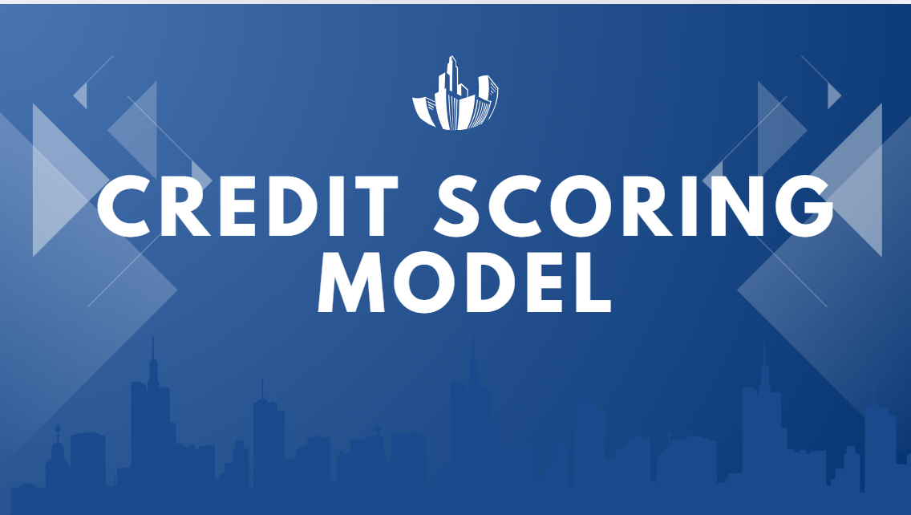

# codealpha_Credit_Scoring_Model

A machine learning-based credit scoring model to predict loan default risk using financial data. Multiple classifiers were evaluated, and the best model was fine-tuned for higher accuracy. Useful for banks and lenders to make informed credit decisions.
# 🎯 Goals of the Project
1.Develop a machine learning-based system to predict an individual’s creditworthiness.

2.Help financial institutions minimize loan default risk by automating credit assessment.

3.Evaluate and compare various classification algorithms such as Logistic Regression, Decision Tree, and Random Forest.

4.Optimize model performance using appropriate metrics like accuracy, precision, recall, F1-score, and AUC-ROC.

# 📌 Research Conclusion
The credit scoring model effectively predicts the likelihood of loan default using financial attributes such as income, credit history, and payment behavior. Among the models tested, [e.g., Random Forest] provided the highest accuracy and AUC-ROC score after fine-tuning. The project demonstrates that machine learning can significantly improve the accuracy and efficiency of credit risk evaluation. With proper deployment, such a model can serve as a decision support tool for banks and lending institutions, reducing manual evaluation time and improving financial risk management.

